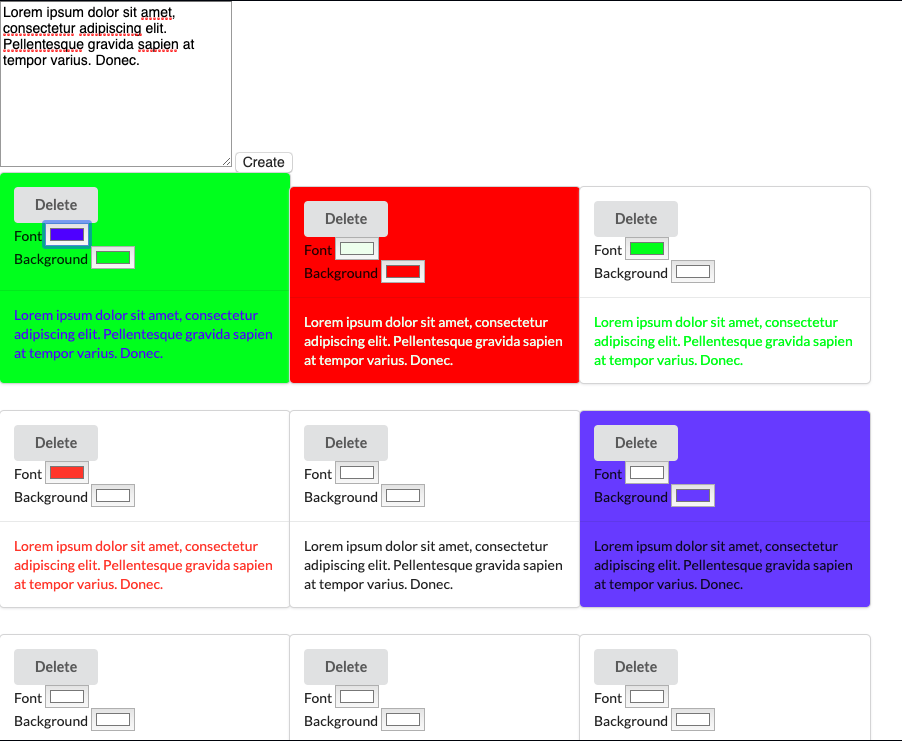

# Alpha and Omega

Date Created: 02/06/20 | Date Modified: 02/06/20

*This assignment is an exercise: (Directions here)[directions.md]*

Preview assignment here: https://trinity-alpha-omega.netlify.com/
***

## Description
- This application makes cards based on the text entered in the textarea by the user

## Features
- User can select the background color for each card individually by selecting a color using the computer's default color picker input.

- User can select the font color for each card individually by selecting a color using the computer's default color picker input.

- User has the ability to delete each card individually by clicking assigned delete button

